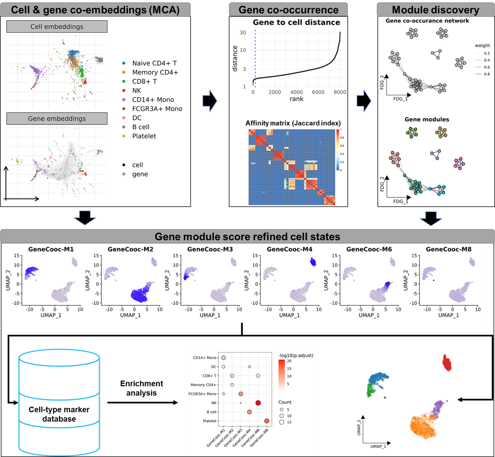

```{r, include = FALSE}
knitr::opts_chunk$set(
  collapse = TRUE,
  comment = "#>",
  fig.path = "man/figures/README-",
  out.width = "100%"
)
```

```{r echo=FALSE, results="hide", message=FALSE}
library("badger")
```

# GeneCooc

[](http://www.repostatus.org/#active)
`r badge_devel("jarninggau/GeneCooc", "green")`

`GeneCooc` is an ultra-fast R package for gene co-expression module discovery facilitates cell state identification.



## Installation

You can install the development version of `GeneCooc` from [GitHub](https://github.com/) with:

``` r
# install.packages("devtools")
# install CelliD (Seurat V4)
devtools::install_github("RausellLab/CelliD", ref="e306b43")
# install GeneCooc
devtools::install_github("JarningGau/GeneCooc")
```

Note: `GeneCooc` is compitable with Seurat V4, we did not test the codes on Seurat V5.

## Quick start

1. Calculate the gene to cell distance and rank the genes by this distance for each cell.

```r
seu <- CalGeneRankings(seu, min.expr.cells = 100)
```

2. Calculate the gene affinity matrix. The gene affinity is measured by co-occurance ratio.

```r
seu <- CalAffinityMatrix(seu, K = 200, min.freq = 10)
```

3. Find modules. 

The major modules are divided by louvain cluster on gene-gene coexpression graph defined by gene affinity matrix. Then minor modules are divided using the dynamic tree cut on a hierarchical tree for each major module.

```r
seu <- FindModules(seu)
```

4. Trim the minor modules by archytype analysis.

```r
seu <- TrimModules(seu)
```

5. Merge the similary minor modules automaticall。

```r
seu <- AutoMergeModules(seu)
```


6. Scoring each gene module.

```r
seu <- CalModuleScore(seu)
```

